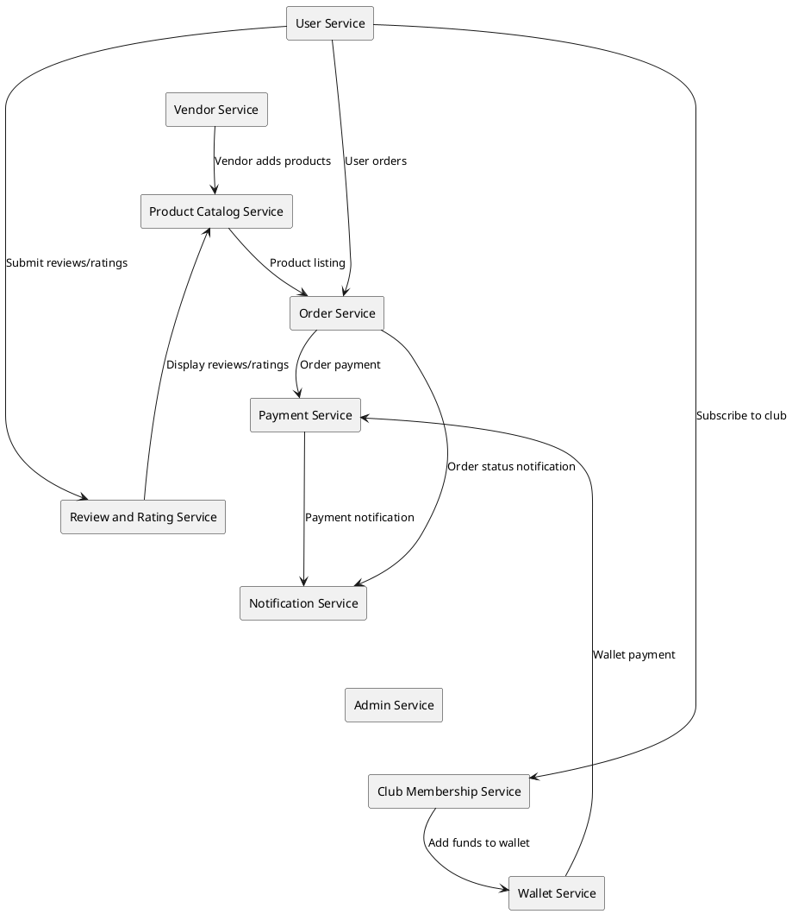

# Multi-vendor E-commerce Micro-Service Design Shop

## Background

The multi-vendor e-commerce platform aims to provide a comprehensive solution for managing an online marketplace where multiple vendors can list and sell their products. The platform needs to support all general e-commerce features, including user management, product catalog, order processing, payment handling, and more. Additionally, the platform will include advanced features such as club memberships and wallet functionalities to enhance user experience and loyalty.

## Requirements

### Functional Requirements

*Must Have*:
- User Management
  - User Registration and Authentication
  - User Profile Management
- Vendor Management
  - Vendor Registration and Authentication
  - Vendor Profile Management
  - Vendor Product Management
- Product Catalog
  - Product Listing and Search
  - Category Management
- Order Processing
  - Cart Management
  - Order Placement
  - Order Tracking
- Payment Handling
  - Integration with Payment Gateways
  - Payment Processing
- Review and Rating System
  - Product Reviews
  - Vendor Ratings
- Notification System
  - Email/SMS Notifications for Order Status
- Admin Dashboard
  - User Management
  - Vendor Management
  - Order Management
  - Reports and Analytics
- Club Membership
  - Club Subscription Management
  - Exclusive Member Benefits and Discounts
- Wallet
  - Wallet Balance Management
  - Add Funds to Wallet
  - Wallet Payment Integration

*Should Have*:
- Performance Optimization for fast search and listing
- Horizontal scaling capabilities

*Could Have*:
- Additional analytics and reporting features for vendors and admins

*Won't Have*:
- Features not directly related to e-commerce and marketplace functionalities

### Non-Functional Requirements

- **Scalability**: The system should handle high traffic during peak times with horizontal scaling capabilities.
- **Performance**: Ensure low latency for user interactions and fast search and listing functionalities.
- **Reliability**: High availability (99.9% uptime) with robust error handling and retry mechanisms.
- **Security**: Secure user data and payment information with strong authentication and authorization mechanisms.
- **Maintainability**: The system should be easy to update and deploy new features, with clear code documentation and a modular architecture.

Great! Let's move on to the Method section. We'll design the architecture using Golang, gRPC, and a message broker for communication between services. We'll break down the design into several microservices, each responsible for a specific domain of the application.

### Microservices Architecture Overview
1. **User Service**
2. **Vendor Service**
3. **Product Catalog Service**
4. **Order Service**
5. **Payment Service**
6. **Review and Rating Service**
7. **Notification Service**
8. **Admin Service**
9. **Club Membership Service**
10. **Wallet Service**

Each microservice will communicate via gRPC and use a message broker (e.g., Kafka or RabbitMQ) for event-driven communication.

#### Proposed Microservices and Their Responsibilities

- **User Service**: Manages user registration, authentication, and profiles.
- **Vendor Service**: Handles vendor registration, authentication, and product management.
- **Product Catalog Service**: Manages product listings, search, and categories.
- **Order Service**: Takes care of cart management, order placement, and tracking.
- **Payment Service**: Integrates with payment gateways and processes payments.
- **Review and Rating Service**: Handles product reviews and vendor ratings.
- **Notification Service**: Manages email/SMS notifications.
- **Admin Service**: Provides an admin dashboard for managing users, vendors, and orders.
- **Club Membership Service**: Manages club subscriptions and exclusive benefits.
- **Wallet Service**: Manages wallet balance, funds addition, and payments via wallet.

### Microservices Architecture Diagram



### Database Schemas
Each microservice will have its own database to ensure loose coupling and scalability. Here are some example schemas:

#### User Service
```sql
CREATE TABLE users (
    id SERIAL PRIMARY KEY,
    username VARCHAR(50) UNIQUE NOT NULL,
    email VARCHAR(100) UNIQUE NOT NULL,
    password_hash VARCHAR(255) NOT NULL,
    created_at TIMESTAMP DEFAULT CURRENT_TIMESTAMP,
    updated_at TIMESTAMP DEFAULT CURRENT_TIMESTAMP
);
```

#### Vendor Service
```sql
CREATE TABLE vendors (
    id SERIAL PRIMARY KEY,
    name VARCHAR(100) UNIQUE NOT NULL,
    email VARCHAR(100) UNIQUE NOT NULL,
    password_hash VARCHAR(255) NOT NULL,
    created_at TIMESTAMP DEFAULT CURRENT_TIMESTAMP,
    updated_at TIMESTAMP DEFAULT CURRENT_TIMESTAMP
);
```

#### Product Catalog Service
```sql
CREATE TABLE products (
    id SERIAL PRIMARY KEY,
    vendor_id INT REFERENCES vendors(id),
    name VARCHAR(100) NOT NULL,
    description TEXT,
    price DECIMAL(10, 2) NOT NULL,
    category VARCHAR(50),
    created_at TIMESTAMP DEFAULT CURRENT_TIMESTAMP,
    updated_at TIMESTAMP DEFAULT CURRENT_TIMESTAMP
);

CREATE TABLE categories (
    id SERIAL PRIMARY KEY,
    name VARCHAR(50) UNIQUE NOT NULL,
    created_at TIMESTAMP DEFAULT CURRENT_TIMESTAMP,
    updated_at TIMESTAMP DEFAULT CURRENT_TIMESTAMP
);
```

#### Order Service
```sql
CREATE TABLE orders (
    id SERIAL PRIMARY KEY,
    user_id INT REFERENCES users(id),
    total_amount DECIMAL(10, 2) NOT NULL,
    status VARCHAR(50) NOT NULL,
    created_at TIMESTAMP DEFAULT CURRENT_TIMESTAMP,
    updated_at TIMESTAMP DEFAULT CURRENT_TIMESTAMP
);

CREATE TABLE order_items (
    id SERIAL PRIMARY KEY,
    order_id INT REFERENCES orders(id),
    product_id INT REFERENCES products(id),
    quantity INT NOT NULL,
    price DECIMAL(10, 2) NOT NULL,
    created_at TIMESTAMP DEFAULT CURRENT_TIMESTAMP,
    updated_at TIMESTAMP DEFAULT CURRENT_TIMESTAMP
);
```

#### Payment Service
```sql
CREATE TABLE payments (
    id SERIAL PRIMARY KEY,
    order_id INT REFERENCES orders(id),
    amount DECIMAL(10, 2) NOT NULL,
    status VARCHAR(50) NOT NULL,
    created_at TIMESTAMP DEFAULT CURRENT_TIMESTAMP,
    updated_at TIMESTAMP DEFAULT CURRENT_TIMESTAMP
);
```

#### Review and Rating Service
```sql
CREATE TABLE reviews (
    id SERIAL PRIMARY KEY,
    user_id INT REFERENCES users(id),
    product_id INT REFERENCES products(id),
    rating INT CHECK (rating >= 1 AND rating <= 5),
    comment TEXT,
    created_at TIMESTAMP DEFAULT CURRENT_TIMESTAMP,
    updated_at TIMESTAMP DEFAULT CURRENT_TIMESTAMP
);
```

#### Notification Service
```sql
CREATE TABLE notifications (
    id SERIAL PRIMARY KEY,
    user_id INT REFERENCES users(id),
    message TEXT NOT NULL,
    status VARCHAR(50) NOT NULL,
    created_at TIMESTAMP DEFAULT CURRENT_TIMESTAMP,
    updated_at TIMESTAMP DEFAULT CURRENT_TIMESTAMP
);
```

#### Club Membership Service
```sql
CREATE TABLE memberships (
    id SERIAL PRIMARY KEY,
    user_id INT REFERENCES users(id),
    membership_type VARCHAR(50) NOT NULL,
    start_date TIMESTAMP NOT NULL,
    end_date TIMESTAMP NOT NULL,
    created_at TIMESTAMP DEFAULT CURRENT_TIMESTAMP,
    updated_at TIMESTAMP DEFAULT CURRENT_TIMESTAMP
);
```

#### Wallet Service
```sql
CREATE TABLE wallets (
    id SERIAL PRIMARY KEY,
    user_id INT REFERENCES users(id),
    balance DECIMAL(10, 2) DEFAULT 0.00,
    created_at TIMESTAMP DEFAULT CURRENT_TIMESTAMP,
    updated_at TIMESTAMP DEFAULT CURRENT_TIMESTAMP
);

CREATE TABLE wallet_transactions (
    id SERIAL PRIMARY KEY,
    wallet_id INT REFERENCES wallets(id),
    amount DECIMAL(10, 2) NOT NULL,
    transaction_type VARCHAR(50) NOT NULL,
    created_at TIMESTAMP DEFAULT CURRENT_TIMESTAMP,
    updated_at TIMESTAMP DEFAULT CURRENT_TIMESTAMP
);
```


### Implementation Steps

In this section, we'll outline the steps to implement the designed architecture for the multi-vendor e-commerce platform using Golang, gRPC, and a message broker.

## Implementation

### Step 1: Set Up Project Structure
Create a directory for the project and subdirectories for each microservice.

```
multi-vendor-shop/
├── user-service/
├── vendor-service/
├── product-catalog-service/
├── order-service/
├── payment-service/
├── review-rating-service/
├── notification-service/
├── admin-service/
├── club-membership-service/
├── wallet-service/
├── common/
└── proto/
```

### Step 2: Define gRPC Protobuf Definitions
Create `.proto` files for each service in the `proto/` directory.

Example: `proto/user.proto`
```proto
syntax = "proto3";

package user;

service UserService {
    rpc RegisterUser (RegisterUserRequest) returns (RegisterUserResponse);
    rpc AuthenticateUser (AuthenticateUserRequest) returns (AuthenticateUserResponse);
}

message RegisterUserRequest {
    string username = 1;
    string email = 2;
    string password = 3;
}

message RegisterUserResponse {
    string user_id = 1;
    string message = 2;
}

message AuthenticateUserRequest {
    string email = 1;
    string password = 2;
}

message AuthenticateUserResponse {
    string user_id = 1;
    string token = 2;
    string message = 3;
}
```

### Step 3: Implement gRPC Services in Golang
Generate the gRPC code from the protobuf definitions and implement the service logic in Golang.

Example: `user-service/main.go`
```go
package main

import (
    "context"
    "log"
    "net"

    "github.com/yourusername/multi-vendor-shop/proto"
    "google.golang.org/grpc"
)

type server struct {
    proto.UnimplementedUserServiceServer
}

func (s *server) RegisterUser(ctx context.Context, req *proto.RegisterUserRequest) (*proto.RegisterUserResponse, error) {
    // Implement registration logic
    return &proto.RegisterUserResponse{UserId: "123", Message: "User registered successfully"}, nil
}

func (s *server) AuthenticateUser(ctx context.Context, req *proto.AuthenticateUserRequest) (*proto.AuthenticateUserResponse, error) {
    // Implement authentication logic
    return &proto.AuthenticateUserResponse{UserId: "123", Token: "token", Message: "User authenticated successfully"}, nil
}

func main() {
    lis, err := net.Listen("tcp", ":50051")
    if err != nil {
        log.Fatalf("failed to listen: %v", err)
    }
    grpcServer := grpc.NewServer()
    proto.RegisterUserServiceServer(grpcServer, &server{})
    log.Println("User Service started on port 50051")
    if err := grpcServer.Serve(lis); err != nil {
        log.Fatalf("failed to serve: %v", err)
    }
}
```

### Step 4: Set Up Database for Each Service
Create the necessary tables in the database for each microservice.

Example: `user-service/db.go`
```go
package main

import (
    "database/sql"
    _ "github.com/lib/pq"
    "log"
)

func initDB() *sql.DB {
    connStr := "user=username dbname=mydb sslmode=disable"
    db, err := sql.Open("postgres", connStr)
    if err != nil {
        log.Fatal(err)
    }

    _, err = db.Exec(`
    CREATE TABLE IF NOT EXISTS users (
        id SERIAL PRIMARY KEY,
        username VARCHAR(50) UNIQUE NOT NULL,
        email VARCHAR(100) UNIQUE NOT NULL,
        password_hash VARCHAR(255) NOT NULL,
        created_at TIMESTAMP DEFAULT CURRENT_TIMESTAMP,
        updated_at TIMESTAMP DEFAULT CURRENT_TIMESTAMP
    )`)
    if err != nil {
        log.Fatal(err)
    }
    return db
}
```

### Step 5: Implement Message Broker Integration
Use Kafka or RabbitMQ for message brokering. Configure each service to produce and consume messages as needed.

Example: `order-service/main.go`
```go
package main

import (
    "context"
    "log"
    "net"

    "github.com/segmentio/kafka-go"
    "github.com/yourusername/multi-vendor-shop/proto"
    "google.golang.org/grpc"
)

type server struct {
    proto.UnimplementedOrderServiceServer
}

func (s *server) PlaceOrder(ctx context.Context, req *proto.PlaceOrderRequest) (*proto.PlaceOrderResponse, error) {
    // Implement order placement logic

    // Produce message to Kafka
    w := kafka.Writer{
        Addr:     kafka.TCP("localhost:9092"),
        Topic:    "order-events",
        Balancer: &kafka.LeastBytes{},
    }
    err := w.WriteMessages(ctx, kafka.Message{
        Key:   []byte("order-id"),
        Value: []byte("Order placed"),
    })
    if err != nil {
        log.Fatal("failed to write messages:", err)
    }
    return &proto.PlaceOrderResponse{OrderId: "order123", Message: "Order placed successfully"}, nil
}

func main() {
    lis, err := net.Listen("tcp", ":50052")
    if err != nil {
        log.Fatalf("failed to listen: %v", err)
    }
    grpcServer := grpc.NewServer()
    proto.RegisterOrderServiceServer(grpcServer, &server{})
    log.Println("Order Service started on port 50052")
    if err := grpcServer.Serve(lis); err != nil {
        log.Fatalf("failed to serve: %v", err)
    }
}
```

### Step 6: Implement Client-Side Logic
Develop client-side applications or interfaces to interact with the gRPC services.

### Step 7: Set Up Continuous Integration and Deployment (CI/CD)
Configure CI/CD pipelines to automate testing, building, and deployment of the services.

### Step 8: Monitoring and Logging
Implement monitoring and logging for each service to track performance and issues.

### Step 9: Testing
Write unit tests, integration tests, and end-to-end tests to ensure the correctness and robustness of the system.

### Step 10: Deployment
Deploy the microservices to a cloud provider or on-premises infrastructure using container orchestration tools like Kubernetes.

## Milestones

1. **Project Setup**:
    - Create project structure
    - Define gRPC protobuf definitions
    - Set up databases
2. **Microservices Implementation**:
    - Implement User Service
    - Implement Vendor Service
    - Implement Product Catalog Service
    - Implement Order Service
    - Implement Payment Service
    - Implement Review and Rating Service
    - Implement Notification Service
    - Implement Admin Service
    - Implement Club Membership Service
    - Implement Wallet Service
3. **Message Broker Integration**:
    - Set up Kafka/RabbitMQ
    - Integrate services with message broker
4. **Client-Side Development**:
    - Develop client-side applications
5. **CI/CD Setup**:
    - Configure CI/CD pipelines
6. **Monitoring and Logging**:
    - Implement monitoring and logging
7. **Testing**:
    - Write and run tests
8. **Deployment**:
    - Deploy services to production

## Gathering Results

After deployment, evaluate the system based on the following criteria:

1. **Functional Requirements**:
    - Verify all functionalities are working as expected
2. **Performance**:
    - Measure response times and ensure they meet the requirements
3. **Scalability**:
    - Test the system under load to ensure it can scale horizontally
4. **Reliability**:
    - Monitor uptime and error rates
5. **Security**:
    - Conduct security audits and penetration tests
6. **User Feedback**:
    - Collect and analyze feedback from users and vendors

Sure, let's rewrite the design using Domain-Driven Design (DDD) principles. We'll focus on defining the domains, subdomains, aggregates, entities, value objects, repositories, services, and events. 

### DDD Overview for Multi-vendor E-commerce Platform

**Core Domains**:
1. User Management
2. Vendor Management
3. Product Catalog
4. Order Management
5. Payment Processing
6. Review and Rating System
7. Notification System
8. Admin Management
9. Club Membership
10. Wallet Management

### Domain Descriptions

1. **User Management Domain**
    - **Entities**: User
    - **Value Objects**: UserID, Username, Email, PasswordHash
    - **Aggregates**: UserAggregate
    - **Repositories**: UserRepository
    - **Services**: UserService
    - **Events**: UserRegistered, UserAuthenticated

2. **Vendor Management Domain**
    - **Entities**: Vendor
    - **Value Objects**: VendorID, VendorName, VendorEmail, VendorPasswordHash
    - **Aggregates**: VendorAggregate
    - **Repositories**: VendorRepository
    - **Services**: VendorService
    - **Events**: VendorRegistered

3. **Product Catalog Domain**
    - **Entities**: Product, Category
    - **Value Objects**: ProductID, CategoryID, ProductName, Description, Price
    - **Aggregates**: ProductAggregate
    - **Repositories**: ProductRepository
    - **Services**: ProductService
    - **Events**: ProductAdded, ProductUpdated

4. **Order Management Domain**
    - **Entities**: Order, OrderItem
    - **Value Objects**: OrderID, OrderStatus, OrderTotal, OrderItemID, Quantity, Price
    - **Aggregates**: OrderAggregate
    - **Repositories**: OrderRepository
    - **Services**: OrderService
    - **Events**: OrderPlaced, OrderStatusUpdated

5. **Payment Processing Domain**
    - **Entities**: Payment
    - **Value Objects**: PaymentID, PaymentStatus, Amount
    - **Aggregates**: PaymentAggregate
    - **Repositories**: PaymentRepository
    - **Services**: PaymentService
    - **Events**: PaymentProcessed

6. **Review and Rating System Domain**
    - **Entities**: Review, Rating
    - **Value Objects**: ReviewID, RatingValue, Comment
    - **Aggregates**: ReviewAggregate
    - **Repositories**: ReviewRepository
    - **Services**: ReviewService
    - **Events**: ReviewSubmitted

7. **Notification System Domain**
    - **Entities**: Notification
    - **Value Objects**: NotificationID, Message, NotificationStatus
    - **Aggregates**: NotificationAggregate
    - **Repositories**: NotificationRepository
    - **Services**: NotificationService
    - **Events**: NotificationSent

8. **Admin Management Domain**
    - **Entities**: Admin
    - **Value Objects**: AdminID, AdminName, AdminEmail
    - **Aggregates**: AdminAggregate
    - **Repositories**: AdminRepository
    - **Services**: AdminService
    - **Events**: AdminCreated

9. **Club Membership Domain**
    - **Entities**: Membership
    - **Value Objects**: MembershipID, MembershipType, StartDate, EndDate
    - **Aggregates**: MembershipAggregate
    - **Repositories**: MembershipRepository
    - **Services**: MembershipService
    - **Events**: MembershipSubscribed

10. **Wallet Management Domain**
    - **Entities**: Wallet, WalletTransaction
    - **Value Objects**: WalletID, Balance, TransactionID, TransactionType, TransactionAmount
    - **Aggregates**: WalletAggregate
    - **Repositories**: WalletRepository
    - **Services**: WalletService
    - **Events**: FundsAdded, PaymentMade

### Microservices Architecture with DDD

Each bounded context will correspond to a microservice. Here’s how each microservice can be structured:

#### User Management Microservice
```go
package user

import (
    "context"
    "time"
)

// Value Objects
type UserID string
type Username string
type Email string
type PasswordHash string

// Entity
type User struct {
    ID           UserID
    Username     Username
    Email        Email
    PasswordHash PasswordHash
    CreatedAt    time.Time
    UpdatedAt    time.Time
}

// Aggregate
type UserAggregate struct {
    User User
}

// Repository
type UserRepository interface {
    Save(ctx context.Context, user *User) error
    FindByID(ctx context.Context, id UserID) (*User, error)
}

// Service
type UserService struct {
    repo UserRepository
}

func (s *UserService) RegisterUser(ctx context.Context, username Username, email Email, passwordHash PasswordHash) (*User, error) {
    user := &User{
        ID:           UserID(generateID()),
        Username:     username,
        Email:        email,
        PasswordHash: passwordHash,
        CreatedAt:    time.Now(),
        UpdatedAt:    time.Now(),
    }
    err := s.repo.Save(ctx, user)
    if err != nil {
        return nil, err
    }
    publishEvent(UserRegistered{UserID: user.ID})
    return user, nil
}

func (s *UserService) AuthenticateUser(ctx context.Context, email Email, passwordHash PasswordHash) (*User, error) {
    user, err := s.repo.FindByEmail(ctx, email)
    if err != nil {
        return nil, err
    }
    if user.PasswordHash != passwordHash {
        return nil, errors.New("invalid credentials")
    }
    publishEvent(UserAuthenticated{UserID: user.ID})
    return user, nil
}

// Events
type UserRegistered struct {
    UserID UserID
}

type UserAuthenticated struct {
    UserID UserID
}
```

### Example Bounded Contexts and Microservices

Similarly, you can define the structures for other domains. Here’s an outline for the Product Catalog domain:

#### Product Catalog Microservice
```go
package product

import (
    "context"
    "time"
)

// Value Objects
type ProductID string
type CategoryID string
type ProductName string
type Description string
type Price float64

// Entity
type Product struct {
    ID          ProductID
    VendorID    VendorID
    Name        ProductName
    Description Description
    Price       Price
    CategoryID  CategoryID
    CreatedAt   time.Time
    UpdatedAt   time.Time
}

// Aggregate
type ProductAggregate struct {
    Product Product
}

// Repository
type ProductRepository interface {
    Save(ctx context.Context, product *Product) error
    FindByID(ctx context.Context, id ProductID) (*Product, error)
}

// Service
type ProductService struct {
    repo ProductRepository
}

func (s *ProductService) AddProduct(ctx context.Context, vendorID VendorID, name ProductName, description Description, price Price, categoryID CategoryID) (*Product, error) {
    product := &Product{
        ID:          ProductID(generateID()),
        VendorID:    vendorID,
        Name:        name,
        Description: description,
        Price:       price,
        CategoryID:  categoryID,
        CreatedAt:   time.Now(),
        UpdatedAt:   time.Now(),
    }
    err := s.repo.Save(ctx, product)
    if err != nil {
        return nil, err
    }
    publishEvent(ProductAdded{ProductID: product.ID})
    return product, nil
}

// Events
type ProductAdded struct {
    ProductID ProductID
}
```

### Message Broker Integration
For event-driven communication, we will use a message broker such as Kafka or RabbitMQ to publish and subscribe to domain events. Here’s an example of publishing an event:

```go
func publishEvent(event interface{}) {
    // Serialize event to JSON or Protobuf
    eventData, _ := json.Marshal(event)

    // Publish to message broker
    msg := kafka.Message{
        Key:   []byte(fmt.Sprintf("%T", event)),
        Value: eventData,
    }
    kafkaWriter.WriteMessages(context.Background(), msg)
}
```

### Implementation Steps
Now, let's define the implementation steps for the DDD-based microservice architecture.

1. **Project Setup**:
   - Create the project structure with directories for each bounded context.
   - Define the protobuf files for gRPC communication.
   - Set up databases for each microservice.

2. **Domain Implementation**:
   - Implement the domain model, including entities, value objects, aggregates, repositories, services, and events for each bounded context.

3. **Service Implementation**:
   - Implement the gRPC services and handlers for each microservice.
   - Integrate the message broker for event-driven communication.

4. **Client-Side Development**:
   - Develop client applications or interfaces to interact with the gRPC services.

5. **CI/CD Setup**:
   - Configure CI/CD pipelines to automate testing, building, and deployment of the services.

6. **Monitoring and Logging**:
   - Implement monitoring and logging for each service to track performance and issues.

7. **Testing**:
   - Write unit tests, integration tests, and end-to-end tests to ensure the correctness and robustness of the system.

8. **Deployment**:
   - Deploy the microservices to a cloud provider or on-premises infrastructure using container orchestration tools like Kubernetes.

### Milestones
1. **Project Setup**:
   - Create project structure
   - Define gRPC protobuf definitions
   - Set up databases

2. **Domain Implementation**:
   -

 Implement User Management Domain
   - Implement Vendor Management Domain
   - Implement Product Catalog Domain
   - Implement Order Management Domain
   - Implement Payment Processing Domain
   - Implement Review and Rating System Domain
   - Implement Notification System Domain
   - Implement Admin Management Domain
   - Implement Club Membership Domain
   - Implement Wallet Management Domain

3. **Service Implementation**:
   - Implement User Service
   - Implement Vendor Service
   - Implement Product Catalog Service
   - Implement Order Service
   - Implement Payment Service
   - Implement Review and Rating Service
   - Implement Notification Service
   - Implement Admin Service
   - Implement Club Membership Service
   - Implement Wallet Service

4. **Message Broker Integration**:
   - Set up Kafka/RabbitMQ
   - Integrate services with message broker

5. **Client-Side Development**:
   - Develop client-side applications

6. **CI/CD Setup**:
   - Configure CI/CD pipelines

7. **Monitoring and Logging**:
   - Implement monitoring and logging

8. **Testing**:
   - Write and run tests

9. **Deployment**:
   - Deploy services to production

### Gathering Results
After deployment, evaluate the system based on the following criteria:

1. **Functional Requirements**:
   - Verify all functionalities are working as expected

2. **Performance**:
   - Measure response times and ensure they meet the requirements

3. **Scalability**:
   - Test the system under load to ensure it can scale horizontally

4. **Reliability**:
   - Monitor uptime and error rates

5. **Security**:
   - Conduct security audits and penetration tests

6. **User Feedback**:
   - Collect and analyze feedback from users and vendors
